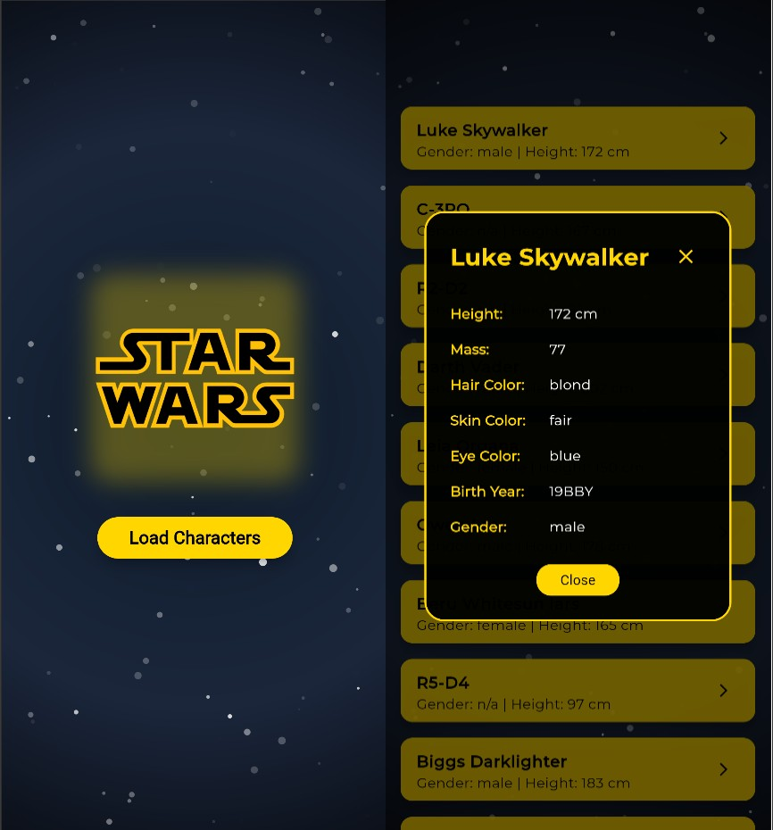

# Star Wars Character List

Aplikasi Flutter yang menampilkan daftar karakter Star Wars dari API [swapi.info](https://swapi.info/api/people) dengan tampilan modern.

## Preview



## Fitur

- Menampilkan list karakter Star Wars
- Detail karakter dalam dialog
- Tema warna kuning, hitam, putih
- Background animasi bintang
- State management menggunakan BLoC

## Teknologi yang Digunakan

- [Flutter](https://flutter.dev/)
- [BLoC (flutter_bloc)](https://pub.dev/packages/flutter_bloc)
- [Equatable](https://pub.dev/packages/equatable)
- [HTTP](https://pub.dev/packages/http)
- [Google Fonts](https://pub.dev/packages/google_fonts)

## Struktur Folder

- `lib/blocs/` : BLoC, Event, State
- `lib/models/` : Model karakter
- `lib/services/` : Service API
- `lib/shared/` : Theme, shared values
- `lib/ui/` : UI utama
- `lib/main.dart` : Routing & root

## Cara Install & Menjalankan

1. Clone repo ini
2. Jalankan perintah berikut:

   ```bash
   flutter pub get
   flutter run
   ```

## API

Data diambil dari: [https://swapi.info/api/people](https://swapi.info/api/people)

---

Created by Muhammad Dimas Rafi
